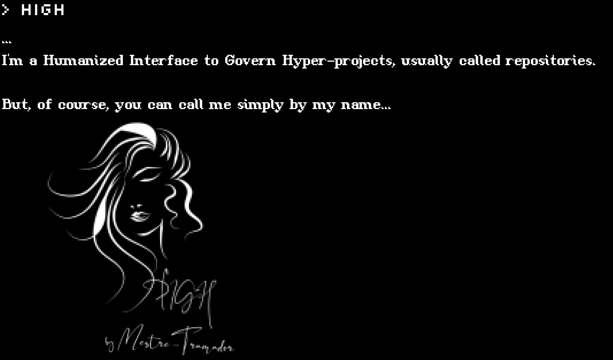

<p id="high" align="center">
  <a href="#high">
    
  </a>
</p>

**Read it also in: [Español], [Português Brasileiro]**

---

<!-- #region Badges -->
<p id="badges" align="center">
  <a href="https://react.dev/">
    
  </a>

  <a href="https://www.typescriptlang.org/">
    
  </a>

  <a href="https://sass-lang.com/">
    
  </a>
</p>
<!-- #endregion -->

<!-- #region Sub-Badges -->
<p id="sub-badges" align="center">
  <a href="https://create-react-app.dev/">
    
  </a>

  <a href="https://www.npmjs.com/">
    
  </a>

  <a href="https://yarnpkg.com/">
    
  </a>

  <a href="https://pnpm.io/">
    
  </a>

  <a href="https://eslint.org/">
    
  </a>

  <a href="https://prettier.io/">
    
  </a>

  <a href="https://stylelint.io/">
    
  </a>

  <a href="https://developer.mozilla.org/en-US/docs/Web/Progressive_web_apps/">
    
  </a>

  <a href="https://editorconfig.org/">
    
  </a>

  <a href="https://keepachangelog.com/en/1.1.0/">
    
  </a>
</p>
<!-- #endregion -->

Be welcome, once again, my brother or sister of code! This repository is the main
source of my website hosted at GitHub Pages.

## HIGH

HIGH is an acronym for "Humanized Interface to Govern Hyper-Projects", which,
in simple terms, consists in a software to manage my repositories, curriculum vitae
and links for social media or other sites, but with humanized outputs.

### History

HIGH was created as a recurring subject for my story, "O Manifesto Tramadorista".
Exactly as described before, HIGH was constantly used on a terminal owned by one
of the major characters, "Mestre Tramador", but it managed also his company data.

Of course, it can be pointed as an equivalent of JARVIS, Brother Eye, TARS and
CASE, Samantha, or any other famous fictional AI, but HIGH was not designed to
be like them, nor it was designed to be like ChatGPT or so. HIGH, in the story
and in the reality, is a simple CLI with humanized outputs, it lacks an
"intelligence" component.

I decided to develop and implement it, adapting, of course, to a web project setup,
and to just manage mainly my repositories and CV. This decision was made as I bought
some domains and was studying GitHub Pages, and it is also a good start to create
some online presence, featuring a PWA.

### How to run locally

This project is a simple frontend app, so just select your package manager and
go for it:

<!-- #region Package Managers -->
<details>

  <summary>
    npm
  </summary>

  ```sh
    # First install all dependencies.
    npm install

    # Then start the DEV environment.
    npm run start
  ```

</details>

<details>

  <summary>
    yarn
  </summary>

  ```sh
    # First install all dependencies.
    yarn install

    # Then start the DEV environment.
    yarn run start
  ```

</details>

<details>

  <summary>
    pnpm
  </summary>

  ```sh
    # First install all dependencies.
    pnpm install

    # Then start the DEV environment.
    pnpm run start
  ```

</details>
<!-- #endregion -->

## Contribution

It would be my pleasure to receive contributions from brothers and sisters of code!
If you are interested, checkout the [Contribution Guidelines], although I warn you
beforehand that I'll not take feature requests on this project.

## License

HIGH and all the source code of Mestre-Tramador's pages are currently licensed
under the [GNU GENERAL PUBLIC LICENSE Version 3][LICENSE].

[Español]: docs/README.ES.md
[Português Brasileiro]: docs/README.PT-BR.md
[Contribution Guidelines]: docs/CONTRIBUTING.md
[LICENSE]: LICENSE
