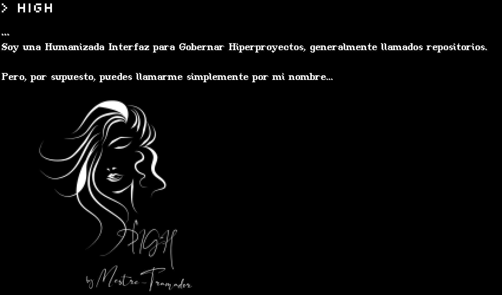

<p id="high" align="center">
  <a href="#high">
    
  </a>
</p>

**Léalo también en: [English], [Português Brasileiro]**

---

<!-- #region Insignias -->
<p id="insignias" align="center">
  <a href="https://react.dev/">
    
  </a>

  <a href="https://www.typescriptlang.org/">
    
  </a>

  <a href="https://sass-lang.com/">
    
  </a>
</p>
<!-- #endregion -->

<!-- #region Subinsignias -->
<p id="subinsignias" align="center">
  <a href="https://create-react-app.dev/">
    
  </a>

  <a href="https://www.npmjs.com/">
    
  </a>

  <a href="https://yarnpkg.com/">
    
  </a>

  <a href="https://pnpm.io/">
    
  </a>

  <a href="https://eslint.org/">
    
  </a>

  <a href="https://prettier.io/">
    
  </a>

  <a href="https://stylelint.io/">
    
  </a>

  <a href="https://developer.mozilla.org/en-US/docs/Web/Progressive_web_apps/">
    
  </a>

  <a href="https://editorconfig.org/">
    
  </a>

  <a href="https://keepachangelog.com/en/1.1.0/">
    
  </a>
</p>
<!-- #endregion -->

¡Sea bienvenido, una vez más, mi hermano o hermana de código! Este repositorio
es el principal código fuente de mi sitio web alojado en GitHub Pages.

## HIGH

HIGH es un acrónimo de "Humanizada Interfaz para Gobernar Hyperproyectos", que,
en términos simples, consiste en un software para administrar mis repositorios,
curriculum vitae y enlaces para redes sociales u otros sitios, pero con outputs humanizadas.

### Historia

HIGH fue creada como tema recurrente para mi cuento, "O Manifesto Tramadorista".
Exactamente como se describió anteriormente, HIGH se usaba constantemente en una
terminal propria de uno de los personajes principales, "Mestre Tramador", y también
administraba los datos de su empresa.

Por supuesto, se puede señalar como una equivalente de JARVIS, Hermano Ojo, TARS
y CASE, Samantha o cualquier otra IA ficticia famosa, pero HIGH no fue diseñada
para ser como ellos, ni fue diseñada para ser como ChatGPT o algo así. HIGH, en
la historia y en la realidad, es una CLI simple con outputs humanizadas, careciendo
de un componente de "inteligencia".

Decidí desarrollarla e implementarla, adaptándome por supuesto a la configuración
de un proyecto web, y solo administrar principalmente mis repositorios y CV. Tomé
esta decisión cuando compré algunos dominios y estaba estudiando las GitHub Pages,
y también es un buen comienzo para crear algo de presencia en línea, con una PWA.

### Cómo ejecutar localmente

Este proyecto es una aplicación frontend simple, así que simplemente seleccione
su administrador de paquetes y hágalo:

<!-- #region Administrador de Paquetes -->
<details>

  <summary>
    npm
  </summary>

  ```sh
    # Primero instale todas las dependencias.
    npm install

    # Luego inicie el entorno DEV.
    npm run start
  ```

</details>

<details>

  <summary>
    yarn
  </summary>

  ```sh
    # Primero instale todas las dependencias.
    yarn install

    # Luego inicie el entorno DEV.
    yarn run start
  ```

</details>

<details>

  <summary>
    pnpm
  </summary>

  ```sh
    # Primero instale todas las dependencias.
    pnpm install

    # Luego inicie el entorno DEV.
    pnpm run start
  ```

</details>
<!-- #endregion -->

## Contribución

¡Sería un placer recibir contribuciones de hermanos y hermanas de código! Si está
interesado, consulte las [Pautas de Contribución], aunque le advierto de antemano
que no aceptaré solicitudes de features en este proyecto.

## Licencia

HIGH y todo el código fuente de las páginas de Mestre-Tramador se encuentran
actualmente abajo la licencia [LICENCIA PÚBLICA GENERAL GNU Versión 3][LICENCIA].

[English]: ../README.md
[Português Brasileiro]: README.PT-BR.md
[Pautas de Contribución]: CONTRIBUTING.ES.md
[LICENCIA]: ../LICENSE
