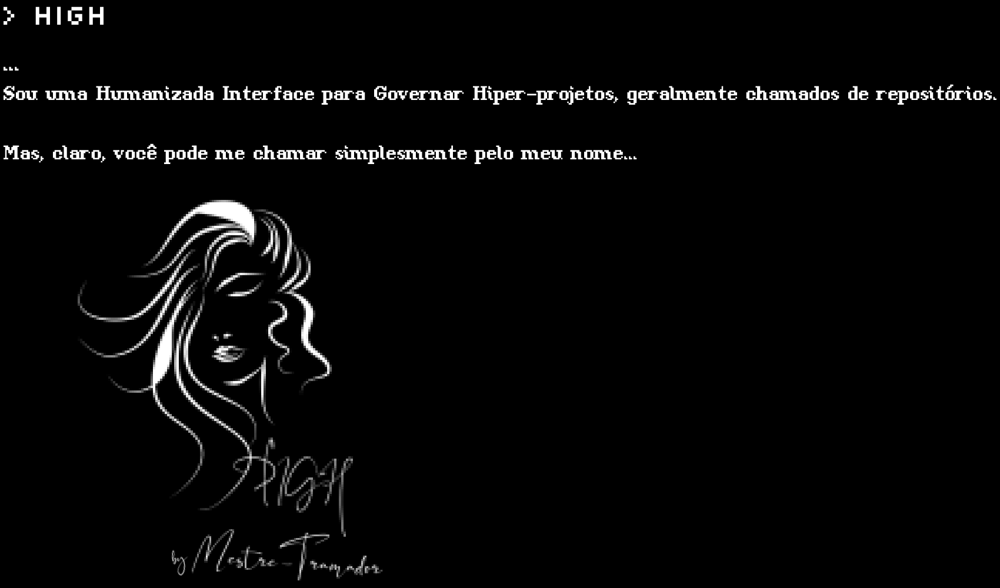

<p id="high" align="center">
  <a href="#high">
    
  </a>
</p>

**Leia também em: [English], [Español]**

---

<!-- #region Insígnias -->
<p id="insignias" align="center">
  <a href="https://react.dev/">
    
  </a>

  <a href="https://www.typescriptlang.org/">
    
  </a>

  <a href="https://sass-lang.com/">
    
  </a>
</p>
<!-- #endregion -->

<!-- #region Sub-insígnias -->
<p id="subinsignias" align="center">
  <a href="https://create-react-app.dev/">
    
  </a>

  <a href="https://www.npmjs.com/">
    
  </a>

  <a href="https://yarnpkg.com/">
    
  </a>

  <a href="https://pnpm.io/">
    
  </a>

  <a href="https://eslint.org/">
    
  </a>

  <a href="https://prettier.io/">
    
  </a>

  <a href="https://stylelint.io/">
    
  </a>

  <a href="https://developer.mozilla.org/en-US/docs/Web/Progressive_web_apps/">
    
  </a>

  <a href="https://editorconfig.org/">
    
  </a>

  <a href="https://keepachangelog.com/en/1.1.0/">
    
  </a>
</p>
<!-- #endregion -->

Seja bem-vindo, mais uma vez, meu irmão ou irmã do código! Este repositório é o
código fonte principal do meu site hospedado nas GitHub Pages.

## HIGH

HIGH é um acrônimo para "Humanizada Interface para Governar Hiper-Projetos", que,
em termos simples, consiste em um software para gerenciar meus repositórios, curriculum
vitae e links para redes sociais ou outros sites, porém com outputs humanizadas.

### História

HIGH foi criada como tema recorrente para a minha história, "O Manifesto Tramadorista".
Exatamente como descrito anteriormente, HIGH era constantemente usado em um terminal
próprio de um dos personagens principais, "Mestre Tramador", mas ela gerenciava
também os dados de sua empresa.

Claro, pode ser apontada como um equivalente de JARVIS, Irmão Olho, TARS e CASE,
Samantha ou qualquer outra IA fictícia famosa, mas HIGH não foi projetada para
ser como eles, nem foi projetada para ser como ChatGPT ou algo assim. HIGH, na
história e na realidade, é uma CLI simples com outputs humanizadas, faltando um
componente de "inteligência".

Resolvi desenvolvê-la e implementá-la, adaptando-me, é claro, a uma configuração
de projeto web, e apenas gerenciando principalmente meus repositórios e currículo.
Essa decisão foi tomada quando comprei alguns domínios e estava estudando as GitHub
Pages, e também é um bom começo para criar alguma presença online, contendo um PWA.

### Como executar localmente

Este projeto é um aplicativo frontend simples, então apenas selecione seu gerenciador
de pacotes e vá em frente:

<!-- #region Gerenciador de Pacotes -->
<details>

  <summary>
    npm
  </summary>

  ```sh
    # Primeiro instale todas as dependências.
    npm install

    # Em seguida, inicie o ambiente DEV.
    npm run start
  ```

</details>

<details>

  <summary>
    yarn
  </summary>

  ```sh
    # Primeiro instale todas as dependências.
    yarn install

    # Em seguida, inicie o ambiente DEV.
    yarn run start
  ```

</details>

<details>

  <summary>
    pnpm
  </summary>

  ```sh
    # Primeiro instale todas as dependências.
    pnpm install

    # Em seguida, inicie o ambiente DEV.
    pnpm run start
  ```

</details>
<!-- #endregion -->

## Contribuição

Seria um prazer receber contribuições dos irmãos e irmãs do código! Se você estiver
interessado, confira as [Diretrizes de Contribuição], embora eu avise de antemão
ue não aceitarei pedidos de features neste projeto.

## Licença

HIGH e todo o código fonte das páginas de Mestre-Tramador estão atualmente
licenciados sob a [LICENÇA PÚBLICA GERAL GNU Versão 3][LICENÇA].

[English]: ../README.md
[Español]: README.ES.md
[Diretrizes de Contribuição]: CONTRIBUTING.PT-BR.md
[LICENÇA]: ../LICENSE
